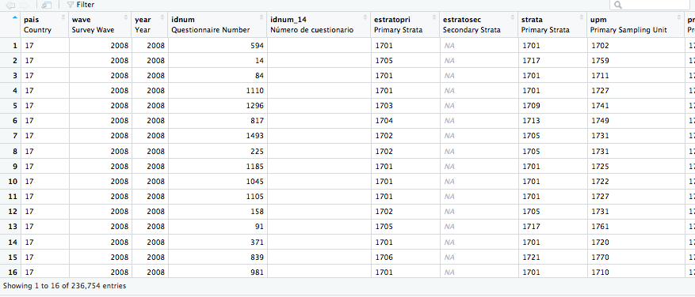
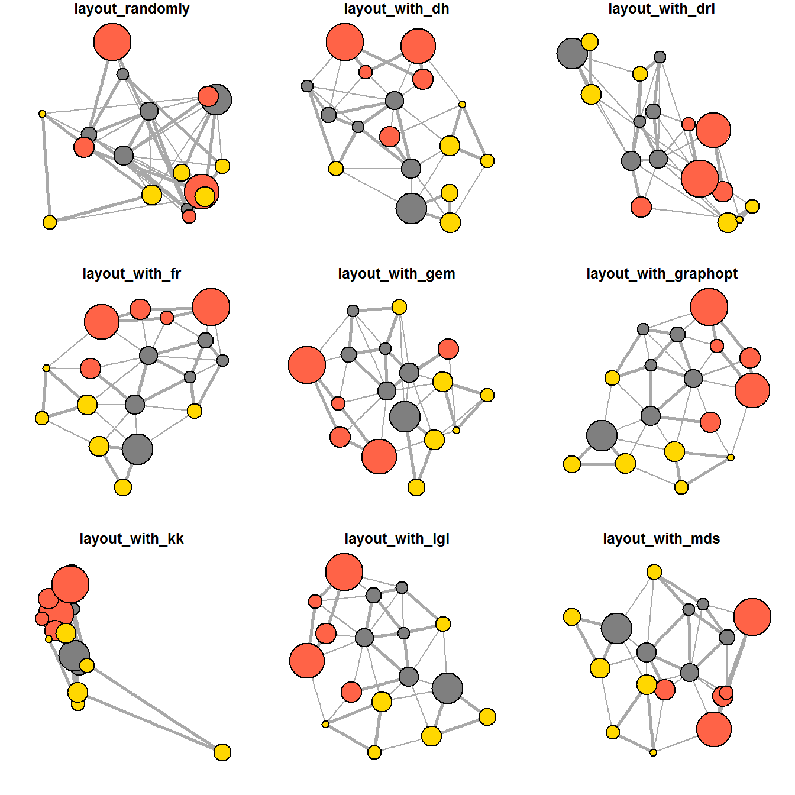
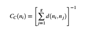
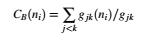

```{r setup, include=FALSE}
knitr::opts_chunk$set(echo = TRUE)
```

## Introducción

Esta guía tiene como objetivo discutir los aspectos básicos del análisis de redes sociales en R. Este documento asume un manejo básico de R. De todos modos, en caso de no tener dicho conocimiento sobre R se proveen fuentes adicionales para introducirse en el uso del software.

Dos ideas básicas deben tenerse en cuenta antes de comenzar el trabajo empírico:

- Las redes sociales tratan sobre vínculos entre objetos. Dicha naturaleza **relacional** tiene implicancias en los objetos (bases de datos) que usamos. En redes sociales **NO HAY DATOS RECTANGULARES**, más bien son estructuras complejas para almacenar vértices/nodos y vínculos/enlaces.

- Existen múltiples paquetes útiles para el análisis de redes sociales, las cuales abarcan una amplia gama de funciones descriptivas y analíticas. Un defecto derivado de lo anterior es que las funciones/comandos en distintos paquetes tienen nombres similares si no idénticos. Esto vuelve necesario ser explícito con las funciones que se desean utilizar. 
 \vspace{12pt}

## Redes Sociales en R: Objetos relacionales

R es un software orientado a objetos. En R, todo es un objeto y existen distintas estructuras para cada caso. En la Figura 1 se presenta la estructura típica de una base de datos rectangular en R (data.frame), dónde las filas son unidades (individuos entrevistados) y las columnas son variables (características preguntadas en la encuesta).

Ahora, el formato rectangular es propio de datos en que las unidades se consideran como aisladas. En redes sociales la **unidad de análisis es la relación entre elementos**, por lo que se necesita una estructura de almacenamiento de datos apropiada para estos fines.El elemento más frecuente es un grafo (graph), que contiene las características de las relaciones (es simultáneamente una representación formal o matemática y una visualización en sí de los vínculos). Se compone de un conjunto de **nodos** (vértices) V y un conjunto de **bordes** (lazos) E. G = (V, E). 

Los nodos/vértices corresponden a  unidades (individuos, organizaciones ,etc.) y se representan por medio de círculos. Los bordes/lazos corresponden a los vínculos entre unidades (pares de nodos) y se representan por medio de líneas que conectan a los nodos. Tanto los nodos como los bordes pueden tener atributos (características).  Muchas veces, el número de vértices V y el número de bordes E se llaman el **orden** y **tamaño** del grafo respectivamente.


\newpage



Producto de lo anterior, existen formatos específicos para almacenar redes. Los dos más comunes son *igraph* y *network*. Ambos corresponden a **listas** que combinan distintos tipos de información (como mínimo un conjunto de nodos y conjunto de bordes e instrucciones respecto a cómo se relacionan ambos elementos). Estos formatos tienen implicancias para los comandos utilizados: los objetos igraph están adaptados para los comandos del paquete igraph, mientras que los network se relacionan a paquetes como sna y statnet. Es posible transformarlos con el paquete *intergraph*.

```{r}
#Objetos igraph
load("terrorist.rda")
class(terrorist)

#Objetos network
load("Moreno.rda")
class(Moreno)

library(intergraph)
Moreno_igraph <- asIgraph(Moreno)
class(Moreno_igraph)
```


De manera más genérica, los objetos que almacenan redes contienen los siguientes tipos de información:

| **Tipo**     | **Descripción**                         | **¿Requerida?**        |
|--------------|-----------------------------------------|------------------------|
| Vértices (V) | Listado nodos (puede incluir etiquetas) | Obligatorio            |
| Bordes   (E) | Listado de bordes/lazos                 | Obligatorio            |
| Atributos V. | Atributos asociados a nodos             | Opcional               |
| Atributos E. | Atributos de los vínculos               | Opcional               |
| Metadata     | Otro tipo de información sobre red      | Depende, comúnmente sí |

\newpage
En igraph, al imprimir un objeto (con los comandos print o summary) se presenta una descripción global de éste. Analizaremos el resultados de summary(igraph_object). En la primera línea aparece:

- IGRAPH : indica que es un objeto de clase igraph.
- ID     : los siguientes 7 caracteres representan un código de ID del gráfo.
- Código Descriptivo de Red: en base a cuatro letras se describe a la red.

1. D/U: si el grafo es direccionado ('D') o no direccionado ('U').
2. N:   si en el grafo los vértices tienen nombres (si no los tienen aparece '-').
3. W:   si el grafo es ponderado (weighted), de modo que los bordes tienen este tipo especial de atributo.
4. B:   si el grafo es bipartito (sus vértices pueden dividirse en dos conjuntos disjuntos e independientes,
        de modo que cada borde conecta a un vértice del conjunto V1 con un vértice del conjunto V2).

- Luego se presenta el  orden (nº de vértices) y tamaño (nº de bordes y después de '--'  se presenta el nombre del grafo (si el grafo tiene nombre).

La segunda línea contiene los atributos (+), separados por una coma:

- Atributos de vértices comienzan con (v/).
- Atributos de bordes comienzan con (e/).
- El tipo de atributo se presenta en el denominador como caracter (/c), numérico (/n), lógico (/l) u otro (/x).


## Paquetes para el Análisis de Redes Sociales

Existe una gran cantidad de paquetes para analizar redes sociales en R. En el sitio de [Francois Briatte](https://github.com/briatte/awesome-network-analysis) pueden encontrar un amplio listado de paquetes para distintos tipos de análisis. Aquí, presentamos una versión un poco más extendida a la utilizada en el laboratorio:

```{r, eval=FALSE, tidy=TRUE}
library(igraph)        #Paquete genérico para el análisis de redes sociales

#1) Paquetes complementarios a igraph

library(igraphdata)    #Contiene distintas bases de datos para aprender el uso de igraph.

library(ggraph)        #Amplía las funciones para generar gráficos de redes. Se basa en la 
#filosofía detrás de ggplot2. Los gráficos se basan en múltiples capas (layouts) y existe 
#una gramática global para su producción.


#2) Relación con otras funciones de R

library(intergraph)           #Permite transformar los objetos igraph en network y viceversa. 
#También posibilita importar/exportar redes provenientes de otros softwares y extraer la 
#información en datos rectangulares.

library(tidygraph)            #Permite incorporar igraph en el esquema de trabajo del tidyverse.


#3) Otros paquetes (y enfoques) para el análisis de redes. Estos paquetes cumplen funciones similares
#a igraph, pero generan objetos de otro tipo y operan bajo otra dinámica.
library(network)            
library(statnet)                
library(sna)

```

Es importante tener en consideración que los nombres de las funciones de R para el análisis de redes son, en muchos casos, idénticos a los de otras funciones (para análisis de redes o tareas más generales). Esto se refleja recurrentemente entre el paquete *statnet* e *igraph*. De ahí que sea necesario en el trabajo empírico usar invocar explícitamente las funciones, señalando el paquete al cual pertenecen. A continuación, un ejemplo sencillo:

```{r, error=TRUE, message=FALSE}
#Cargamos tres paquetes para el análisis de redes
library(igraph)
library(igraphdata)
library(statnet)

data("karate")   #Cargamos la red (objeto igraph) de un clud de Karate universitario  

#Calcularemos un indicador simple de la estructura de la red: el grado o número 
#de vínculos (edges).
degree(karate)
```

¿Por qué falla el código? El error en específico se refiere a la estructura del objeto utilizado. Sin embargo, se **causa**  porque la función para calcular el número de ties/edges se llama degree en los paquetes igraph y statnet. Sin embargo, los argumentos de las funciones son distintos en cada paquete. Necesitamos indicar que los paquetes

```{r}
igraph::degree(karate)
```

## Construcción de Redes

Existen múltiples comandos en igraph (y en otros paquetes) para construir objetos de redes. El comando más simple es *graph.formula*:

```{r}
grafo_01 <-  graph.formula(1-2, 1-3, 2-3, 2-4, 3-5, 4-5, 4-6, 4-7, 5-6, 6-7)

summary(grafo_01)
```

Sin embargo, es poco viable que las redes sean construidas "manualmente" en R. De ahí que es importante tener en cuenta tres estructuras de representación de la información:

1. **Lista de Adyacencia**: se representa al grafo por un conjunto de datos de tamaño V (nº de vértices), dónde cada elemento
es una lista de todos los vértices j con los cuales dicho vértice i comparte un borde.

```{r}
get.adjlist(grafo_01)
```

2. **Lista de Bordes**: es un listado con dos columnas de todos los pares de vértices unidos por un borde.

```{r}
get.edgelist(grafo_01)
```

3. **Sociomatriz o matriz de adyacencia**: es una matriz Nv x Nv (tanto las filas como las columnas corresponden a los vértices) y los bordes son representados -comúnmente con un 1- por las celdas. Si no hay borde/lazo, la celda está vacía:

```{r}
get.adjacency(grafo_01)
```

Derivadas de estas estructuras se derivan múltiples comandos para la construcción de redes (para más detalles ver documentación de igraph):

- graph_from_adjlist
- graph_from_adjacency_matrix
- graph_from_edgelist
- graph_from_data_frame

```{r}
#Sociomatriz
net_01 <- rbind(c(0,1,1,0,0),
                c(0,0,1,1,0),
                c(0,1,0,0,0),
                c(0,0,0,0,0),
                c(0,0,1,0,0))
net_01

net_01_igraph <- igraph::graph_from_adjacency_matrix(net_01)  #Es lo mismo graph.adjacency
summary(net_01_igraph)


#Edgelist
net_02 <- rbind(c(1,2),
                c(1,3),
                c(2,3),
                c(2,4),
                c(3,2),
                c(5,3))
net_02

net_02_igraph <- igraph::graph_from_edgelist(net_02)  #Es lo mismo graph.edgelist
summary(net_01_igraph)


```

## Características relevantes de redes

Los indicadores descriptivos y analíticos de las redes dependen de una multiplicidad de supuestos sobre la naturaleza de la red. Hasta ahora sólo hemos analizado direccionalidad, pero existen otros. Uno muy relevante es **simplicidad**: ausencia de bucles entre los vértices (no hay bordes cuyos finales conecten a un determinado vértice)

```{r}
igraph::is.simple(Moreno_igraph)    #Es la red simple? ¿Tiene bordes propios?
                                    #Ver el script para un ejemplo de 
                                    #cómo resolverlo si no lo es. 

igraph::ego_size(Moreno_igraph, order = 1 ,
                 V(Moreno_igraph))          #Cuál es el tamaño de los vínculos 
                                            #por vértice? Se calcula el vecindario 
                                            #según el orden (si es 1 son los 
                                            #adyacentes)   

igraph::is.connected(graph = Moreno_igraph)  #¿Todos los vértices son alcanzables por 
                                             #los otros vértices? Igraph NO tiene 
                                             #funciones específicas para detectar isolates
                                             #nodos con degree 0 (sin bordes).

```

## Visualización de Redes Sociales

Ya discutimos la idea de atributos asociados a las redes (sean a vértices, bordes o al grafo en sí). Muchas veces encontrarán en la literatura que al añadir atributos están "decorando la red". Existen múltiples funciones para visualizar redes. Incluso, hay paquetes especializados en esto como **ggraph**. Sin embargo, aquí nos centraremos en igraph.plot (se usa la función con el paquete igraph activo). Este reconoce múltiples parámetros para ajustar la visualización:

| **Elemento** | **argumento**       | **Descripción**                          |
|--------------|---------------------|------------------------------------------|
| Nodo/Vértice | vertex.color        | color de los vértices                    |
| Nodo/Vértice | vertex.frame.color  | color del borde de los vértices          |
| Nodo/Vértice | vertex.shape        | forma de los vértices, sea "none",       |
|              |                     | "circle", "square", "csquare","rectangle"|
|              |                     | "crectangle","vrectangle","pie","raster" |
|              |                     | "sphere"
| Nodo/Vértice | vertex.size         | tamaño de vértices (por defecto 15)      |
| Nodo/Vértice | vertex.size2        | segundo tamaño (para formas especiales)  |
| Nodo/Vértice | vertex.label        | Etiqueta (caracteres) de los vértices    |
| Nodo/Vértice | vertex.label.family | Fuente usada en la etiqueta de vértices  |
|              |                     | "Times", "Helvetica" "Arial" etc.        |    
| Nodo/Vértice | vertex.label.font   | Tipo fuente: 1 "plain", 2 "bold",        | 
|              |                     | 3 "italic", 4 "bold italic", 5 "symbol"  |
| Nodo/Vértice | vertex.label.cex    | Tamaño de la fuente (multiplicador)      |
| Nodo/Vértice | vertex.label.dist   | Distancia entre la etiqueta y vértice    |
| Nodo/Vértice | vertex.label.degree | Posición de etiqueta respecto al vértice |
|              |                     | 0 es right, "pi" es left, "pi/2" es abajo|
|              |                     | "-pi/2" es arriba                        |
| Borde/Lazo   | edge.color          | Color de borde                           |
| Borde/Lazo   | edge.width          | Ancho del borde (por defecto 1)          |
| Borde/Lazo   | edge.arrow.size     | Tamaño de la flecha (direccionada)       |
| Borde/Lazo   | edge.arrow.width    | Ancho de la flecha (direccionada)        |
| Borde/Lazo   | edge.lty            | Tipo de línea del borde 0 o "blank",     |
|              |                     | 1 "solid", 2 "dashed", 3 "dotted",       |
|              |                     | 4 "dotdash", 5 "longdash", 6 "twodash"   |
| Borde/Lazo   | edge.label          | Etiqueta (caracter) de los bordes        |
| Borde/Lazo   | edge.label.family   | Fuente usada en la etiqueta de bordes    |
| Borde/Lazo   | edge.label.font     | Tipo de fuente para etiqueta de borde    |
| Borde/Lazo   | edge.label.cex      | Tamaño de la fuente de etiqueta borde    |
| Borde/Lazo   | edge.curved         | Curvatura borde, se mueve entre 0 y 1    |
| Borde/Lazo   | arrow.mode          | Vector específica que bordes deben tener |
|              |                     | flechas: 0 "no arrow", 1 "back",         |
|              |                     | 2 "forward", 3 "both"                    |
| General      | margin              | Espacio vacío alrededor del grafo        |
|              |                     | es un vector con longitud 4 (cada lado)  |
| General      | frame               | Incluye un marco para el grafo si TRUE   |
| General      | main                | Entre comillas "" se añade un título     |
| General      | sub                 | Entre comillas "" se añade un subtítulo  |

Exploremos algunos parámetros relativos a los vértices:

```{r}
load("Terrorist.rda")

plot.igraph( x = terrorist, vertex.shape = "circle", 
             vertex.label = V(terrorist)$names,vertex.label.family ="Helvetica",
             vertex.label.font = 4, vertex.label.cex = 0.9,vertex.label.dist = 0.1, 
             main ="Red de Terroristas del 11 de Septiembre",
             sub="Según Avión Secuestrado (y su objetivo)", margin =c(0.3,0.3,0.3,0.3))
legend(x = -1.8, y = 1.5 , c("AA-11 (WTC North)","AA-77 (Pentagon)","UA-175 (WTC South)",
                             "UA-93 (Pennsylvania)"),
       pch = 21 , col ="#777777" , pt.bg = c("orange","red","blue","green"), pt.cex = 2, 
       cex = 0.8 , bty = "n", ncol = 1)

```

Ahora centremosnos en los bordes:
```{r}
load("bali.rda")
plot(bali, vertex.shape = "circle" , vertex.label = V(bali)$vertex.names, 
     vertex.color = V(bali)$color,edge.width = E(bali)$IC*1.2, 
     edge.lty ="dashed", main ="Terroristas del atentado a Bali 2002",
     sub = "Célula de Jemaah Islamiyah. Ancho de bordes refleja el nº de\n
     interacciones entre actores. Datos provenientes de Koschade, 2006")
legend(x = -1.8, y = 1.5 , c("Equipo de Mando","Asistentes Opertivos",
                             "Fabricante Explosivo","Atacantes Suicidas",
                             "Equipo Lima"),
       pch = 21 , col ="#777777" , pt.bg = c("red","blue","yellow","brown",
                                             "orange"), pt.cex = 2, cex = 0.8 , 
       bty = "n", ncol = 1)
```


Un "layout" (diseño) es un algorritmo/criterio para localizar los vértices o bordes en el espacio (existen los objetos y sus relaciones, pero estás no tienen un localización específica, no hay en redes un equivalente a coordenadas). Estos son un simple argumento para el plot. Está más allá de este taller discutir distintos tipos de layouts.




\newpage
## Indicadores de Centralidad y Otros descriptivos de Redes

La localización de los objetos (vértices/nodos) dentro de la red nos permite evaluar su prominencia. Un objeto/agente es prominente si los vínculos de éste lo hacen visible a los otros miembros de la red. 

- En redes no direccionadas se evalúa centralidad: nodos centrales son aquellos que cuentan con muchos bordes.
- En redes direccionadas se tiende a hablar de prestigio para describir la multiplicidad de vínculos.
- Es posible agregar estas métricas individuales (son para los nodos/vértices) en medidas agregadas para la red. 

La centralidad es un aspecto descriptivo de la posición de los nodos dentro de la red: mientras más centrales éstos sean, mayores vínculos poseen, lo cual tiene implicancias (mayor acceso a recursos por ejemplo). Hay tres operacionalizaciones básicas de centralidad:

1. Centralidad por grado (degree).
2. Centralidad por cercanía (closeness).
3. Centralidad por intermediación (betweenness).


**Centralidad por Grado**: más lazos/bordes vuelve más prominente al nodo/vértice. 

Centralidad(vertice_i) = d(vertice_i) = Nº de lazos vértice i

**Centralidad por Cercanía**: ¿qué tan cerca está cada vértice de los otros en la red? Los nodos más prominentes/centrales son los que están más próximos a los restantes. Es el inverso de la suma de las distancias entre el vértice i y todos los otros vértices en la red.



**Centralidad por Intermediación**: ¿en qué medida un vértice se sitúa entre medio de un par de nodos cualquiera de la red? Esto, de modo tal que el camino entre otros vértices pase por este vértice. Aquí la prominencia se vincula con el flujo de información/recursos. Se basa en distancias geodésicas (menores distancias posibles entre dos vértices). 




Analizemos una nueva red para estudiar estos conceptos:
```{r}
data(kite)

plot(kite)

#Centralidad por grado
igraph::degree(kite)    #El nodo más prominente es el D

#Centralidad por cercanía
igraph::closeness(kite) #Los nodos más prominentes son el F y G

#Centralidad por intermediación
igraph::betweenness(kite)         #El nodo más prominente es el H.
```

Comúnmente habrá superposición en los resultados de los indicadores de centralidad, pero no siempre es el caso. De ahí que sea importante comprender a cabalidad los indicadores y examinar visualmente la red.  Existen muchos otros indicadores de centralidad, y éstos difieren según redes direccionadas y no direccionadas. 


| **Medición**        | **Comando**        |
|---------------------|--------------------|
| Grado               | degree()           |
| Cercanía            | closeness()        |
| Intermediación      | betweenness()      |
| Autovector          | evcent()           |
| Potencia Bonacich   | bonpow()           |
| Alfa de Bonacich    | alpha.centrality() |
| Autoridad Kleinberg | auth.score()       |
| Kleinberg hub       | hub.score()        |
| PageRank            | page.rank()        |

No es posible abarcar en esta guía más tópicos del análisis descriptivo de redes. A modo de hoja de ruta, conceptos relevantes a comprender son:

- Densidad, reciprocidad y transitividad.
- Tamaño, Orden.
- Hubs y autoridades.
- Subgrupos, comunidades, cliques.


\newpage
## Fuentes Adicionales

Existen muchas fuentes adicionales para continuar con lo revisado en este laboratorio. El área está en constante desarrollo, por lo que la mejor fuente para buscar ayuda es internet. A continuación, algunos artículos, trabajos y libros que pueden servir para la investigación empírica en redes sociales usando R.

1) **Libros Generales sobre R**

- [R in Action: Data Analysis and Graphics with R](https://www.amazon.com/Action-Data-Analysis-Graphics/dp/1617291382/ref=pd_sbs_14_6?_encoding=UTF8&pd_rd_i=1617291382&pd_rd_r=BF3HK7MMP6W3FFK1H8TQ&pd_rd_w=CV0Zm&pd_rd_wg=7QZuN&psc=1&refRID=BF3HK7MMP6W3FFK1H8TQ) de Robert Kabacoff. Buena introducción general a R con distintos ámbitos.

- [R for Data Science: Import, Tidy, Transform, Visualize, and Model Data](https://www.amazon.com/Data-Science-Transform-Visualize-Model/dp/1491910399/ref=pd_bxgy_14_2?_encoding=UTF8&pd_rd_i=1491910399&pd_rd_r=QR1AA7P6WH0DQ9P7X4W0&pd_rd_w=xr1jD&pd_rd_wg=H32ix&psc=1&refRID=QR1AA7P6WH0DQ9P7X4W0) de Hadley Wicham y Garrett Grolemund. Buena introducción desde una perspectiva muy popular hoy en día: tidyverse.

- [Quantitative Social Science: An Introduction](https://www.amazon.com/Quantitative-Social-Science-Kosuke-Imai/dp/0691175462/ref=sr_1_sc_1?s=books&ie=UTF8&qid=1515548160&sr=1-1-spell&keywords=quantitative+iimai) de Kosuke Imai. El libro introduce el análisis de datos usando R. En el quinto capítulo introduce las redes sociales en un contexto más amplio de tipos de datos.


2) **Libros Especializados sobre Análisis de Redes en R**

- [Statistical Analysis of Network Data with R](https://www.amazon.com/Statistical-Analysis-Network-Data-Use-ebook/dp/B00PULZXI8/ref=sr_1_17?s=books&ie=UTF8&qid=1515547726&sr=1-17&keywords=social+networks+R) de Eric Kolaczyk y Gábor Csárdi. Manual extensivo de los aspectos básicos del análisis de redes con R, usando el paquete igraph.

- [A User's Guide to Network Analysis in R](https://www.amazon.com/Users-Guide-Network-Analysis/dp/3319238825/ref=sr_1_4?s=books&ie=UTF8&qid=1515547906&sr=1-4&keywords=douglas+luke) de Douglas Luke. Libro sencillo como introducción al ABC del análisis de redes sociales. Mayor enfásis en el uso del paquete statnet y relacionados.

3) **Recursos Web**

- [Network Analysis in R](https://www.datacamp.com/courses/network-analysis-in-r) Curso de datacamp (pagado) sobre análisis de redes sociales.

- [R Igraph Manual](http://igraph.org/r/doc/). El paquete igraph fue escrito en C++ y es compatible con R y Python. Existe una amplísima documentación de sus funciones en el sitio.

- [Social Network Analysis Labs in R and SoNIA](https://sna.stanford.edu/rlabs.php). Sitio web que reúne los laboratorios y algunas presentaciones sobre análisis de redes sociales. Es un tanto antiguo (2010) y fue dictado por Daniel McFarland, Solomon Messing, Michael Nowak y Sean J. Westwood.

- [Lista de Francois Briatte](https://github.com/briatte/awesome-network-analysis) contiene un amplísimo listado de fuentes y documentos útiles para el análisis de redes. También es el autor del repositorio parlnet, el cual congrega información comparada de legislaturas desde un enfoque de redes.

- [Introduction to Network Analysis with R](https://www.jessesadler.com/post/network-analysis-with-r/). Tutorial escrito por Jesse Sadler.

- [Network Analysis and Visualization with R and igraph](http://kateto.net/networks-r-igraph). Tutorial preparado por Katya Ognyanova.

- [Social Networks in R](http://www.shizukalab.com/toolkits/sna). Códigos y documentos de Daizaburo  Shizuka.

- [Introduction to social network analysis with R](http://pablobarbera.com/big-data-upf/html/02a-networks-intro-visualization.html). Tutorial escrito por Pablo Barberá.

- [Social Network Analysis in R](http://rpubs.com/wctucker/302110). Tutorial de Wilson Tucker.
